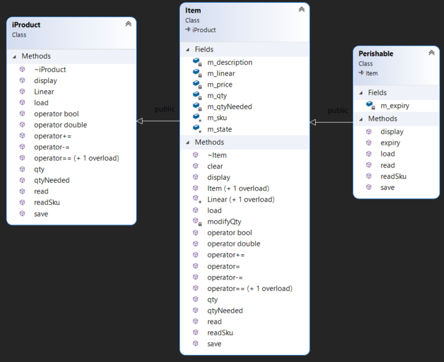

# Project: Disaster and Emergency Aid Management 
## Current project state
 - Milestone 3 (V1.0) released
 - Milestone 3 overview session on Wed March 23rd at 9:50 

## Use case

When disaster hits a nation, the most urgent task is to be able to provide the people affected with what they need as quickly and as efficiently possible.
Your job for this project is to prepare an application that manages the list of items needed to be shipped to the area. The application should be able to keep track of the quantity of each item needed, the number of items on hand, shipping the items and storing the data in a file for future use. 

The types of items needed to be shipped in this situation are divided into two main categories; 

- Non-Perishable products, such as blankets and tents, that have no expiry date. We refer to these types of products as Items.
- Perishable products, such as food and medicine, that have an expiry date. We refer to these products as Perishables. 

To accomplish this task we need to create several classes to encapsulate the problem and provide a solution for this application. 


### Milestones
Overview and Q&A sessions will be held on the dates and times shown below. this is open to all students. If you would like to join, you must use your real (Seneca) name and join using a microphone. (Listen only connections are not allowed, since you can watch the recording later)

|Milestone| Revision |  Overview<br />session |Comments |
|------|:---:|:---:|:----|
| [MS1](#milestone-1) | V1.0 | [Watch the Overview Session (March 7th, 10AM)](https://youtu.be/ZW09NrkUSzA) ||
| [MS2](#milestone-2) | V1.0 | [Watch the Overview Session (March 7th, 10AM)](https://youtu.be/1qxhpcRfE8Q) ||
| [MS3](#milestone-3) | V0.9 | [Join overview session at 9:50 on Wed Mar 23]() | The tester program will be released shortly|
|  | V1.0 | |  Teseter program added |


## Milestones due dates
This project will be done in 5 milestones and each milestone will have its due date. The due date of each milestone is stated below, and it is based on the amount of work to be done for that milestone. 

> If you would like to successfully complete the project and be on time, **start early** and try to meet all the due dates of the milestones.

## Final project mark and due dates

|Milestone| Mark | Due date | Submission Policy|
|:------:|:---:|:---:|-------|
| MS1 | 10% | Mar 13 | gets full mark even if 1 week late. gets 0% afterwards|
| MS2 | 10% | Mar 17 | gets full mark even if 1 week late. gets 0% afterwards|
| MS3 | 10% | Mar 28 | gets full mark even if 1 week late. gets 0% afterwards|
| MS4 | 10% | Mar 30 | gets full mark even if 1 week late. gets 0% afterwards|
| MS5 | 60% | See below| See below|

> To make the final submission of the project easier and to make it possible to partially submit a project we have divided the submission of milestone 5 into six small ones. Each submission is worth 10% of the project mark. Your project will be marked only if you have all four milestones and at least have one of the 6 six submissions of milestone 5. 

### Milestone 5 submissions
- **Due date**: Apr 10
- Project submission **rejection date**: Apr 17
- **Penalty** for late submissions is **10% per day** up to **maximum of 5 days**. (mark of zero after 5 days)

|Milestone 5<br/> Divided into<br/>Six submission| Description | Comments |
|:------|:---|-------|
| m51  | Menu item 7 and 1  | Mandatory, this is needed for the rest<br /> of the options to be functional|
| m52  | Menu item 2 | Optional with 10% penalty |
| m53  | Menu item 3 | Optional with 10% penalty |
| m54  | Menu item 4 | Optional with 10% penalty |
| m55  | Menu item 5 | Optional with 10% penalty |
| m56  | Menu item 6 | Optional with 10% penalty |

> The first 4 milestones will not be marked based on the code but on their output and their timely submissions. You may modify or debug your previous code as you are going through the milestones. The only milestone that is going to be scrutinized based on the code will be milestone 5. If you require any feedback on your first four milestones you need to ask your professor to do so.

***NOTE:***<br/>
**Your project will receive a mark of zero if any of the milestones are not submitted by [the rejection date](#milestone-5-submissions)<br />For your project to be marked, you must submit all the 4 milestones and at least one of the 6 submissions of Milestone 5**

### Checking Due dates using the submitter program

You can check the due date of each milestone using the ```-due``` flag in the submission command:
```bash
~profname.proflastname/submit 2??/prj/m? -due
```
- replace **2??** with the subject code
- replace **m?** with the milestone number

## Citation, Sources

Every file that you submit must contain (as a comment) at the top:<br />
**your name**, **your Seneca email**, **Seneca Student ID** and the **date** when you completed the work.

### For work that is done entirely by you (ONLY YOU)

If the file contains only your work or the work provided to you by your professor, add the following message as a comment at the top of the file:

> I have done all the coding by myself and only copied the code that my professor provided to complete my workshops and assignments.

### For work that is done partially by you.

If the file contains work that is not yours (you found it online or somebody provided it to you), **write exactly which part of the assignment is given to you as help, who gave it to you, or which source you received it from.**  By doing this you will only lose the mark for the parts you got help for, and the person helping you will be clear of any wrongdoing.

> - Add the citation to the file in which you have the borrowed code
> - In the 'reflect.txt` submission of milestone 5, add exactly what is added to which file and from where (or whom).

> :warning: This submission Policy only applies to the project. All other assessments in this subject have their own submission policies.

### If you have helped someone with your code

If you have helped someone with your code. Let them know of these regulations and in your 'reflect.txt' of milestone 5, write exactly which part of your code was copied and who was the recipient of this code.<br />By doing this you will be clear of any wrongdoing if the recipient of the code does not honour these regulations.

## Compiling and Testing Your Program

All your code should be compiled using this command on `matrix`:

```bash
g++ -Wall -std=c++11 -g -o ms file1.cpp file2.cpp ...
```

- `-Wall`: the compiler will report all warnings
- `-std=c++11`: the code will be compiled using the C++11 standard
- `-g`: the executable file will contain debugging symbols, allowing *valgrind* to create better reports
- `-o ms`: the compiled application will be named `ms`

After compiling and testing your code, run your program as following to check for possible memory leaks (assuming your executable name is `ms`):

```bash
valgrind -s --leak-check=full ms
```

To check the output, use a program that can compare text files.  Search online for such a program for your platform, or use *diff* available on `matrix`.

### Citation template
you an use the following template for your citations.

```C++
/* Citation and Sources...
Final Project Milestone ? 
Module: Whatever
Filename: Whatever.cpp
Version 1.0
Author	John Doe
Revision History
-----------------------------------------------------------
Date      Reason
2020/?/?  Preliminary release
2020/?/?  Debugged DMA
-----------------------------------------------------------
I have done all the coding by myself and only copied the code 
that my professor provided to complete my workshops and assignments.
-----------------------------------------------------------
OR
-----------------------------------------------------------
Write exactly which part of the code is given to you as help and 
who gave it to you, or from what source you acquired it.
-----------------------------------------------------------*/
```

**Failing to include the above citation to the files containing your work will cause the rejection of your project submission**

## Project Implementation notes:  *Very Important, read carefully*
- All the code written in this project should be within the `namespace sdds`.
- You are free and encouraged to add any attributes(member variables) or methods (member functions) you find necessary to complete your code. If you are not sure about your strategy for adding functionalities and properties to your classes, ask your professor for advice.
- You are free and encouraged to add additional utility functions to ease coding and reduce logic redundancy. For this, a module called Utils is created, implementing the class Utils. This class is initialized under a global object named `ut`.  Member functions added to this class are accessible throughout the project using the `ut` instance by including `"Utils.h"`. [see Utils]() 
- If additional methods are being added to classes and they are not called outside the scope of the class, make sure they are private.
- Unless you are asked for a specific definition, name the variables, and functions yourself. Use proper names and follow the naming conventions instructed by your professor. Having meaningless and misleading names will attract a penalty.
- When creating methods make sure to make them constant if in their logic, they are not modifying their class.
- When passing an object or variable by address or reference, if they are not to be modified, make sure they are passed as constant pointers and references.
- When deallocating memory if afterwards the status of its pointer is unknown, set it to nullptr to be safe.
- If an Empty state is required for an object, it is considered to be an “invalid” empty state, and objects in this state should be rendered unusable.
- You may reuse and copy any code your professor provided for your workshops or functions you may have from previous work in this subject or other subjects by placing them it in the Utils module as member functions or helper functions.

# The Project


# Milestone 1
Before we start developing the application, we need to have a few classes developed to help us with the dates in the system, handling state of the object (error handling), Menus and also a mock-up of the user interface of the application. Also, we need to get familiarized with the Utils module.

# The Utils module  
## Utils.h
```C++
namespace sdds {
   // Testing date values for application testing and debugging
   // these values must not change at submission time.
   const int sdds_testYear = 2022;
   const int sdds_testMon = 03;
   const int sdds_testDay = 31;
   class Utils {
      bool m_testMode = false;
   public:
      // this function will be used to get the current system date or the test date if m_testMode is true
      void getSystemDate(int* year = nullptr, int* mon = nullptr, int* day = nullptr);
      // this function will return the number of days in a month based on the year
      // 1<=mon<=12  year: four digit number (example: 2021)
      int daysOfMon(int mon, int year)const;
      // Puts the system date in test mode, where getSystemDate() function will return 2022, 03, 31
      // or whatever the three constant test dates are set to
      void testMode(bool testmode = true);
   };
   extern Utils ut;  // provides global access to the ut instance in the Utils.cpp file
}

```
## Utils.cpp
```C++
#define _CRT_SECURE_NO_WARNINGS
#include <iostream>
#include <ctime>
#include "Utils.h"
using namespace std;
namespace sdds {
   // The ut object of type Utils that is accessible to any file including "Utils.h" to call the Utils
   // methods
   Utils ut;  
   
   void Utils::testMode(bool testmode) {
      m_testMode = testmode;
   }
   void Utils::getSystemDate(int* year, int* mon, int* day) {
      if (m_testMode) {
         if(day) *day = sdds_testDay;
         if(mon) *mon = sdds_testMon;
         if(year) *year = sdds_testYear;
      }
      else {
         time_t t = std::time(NULL);
         tm lt = *localtime(&t);
         if (day) *day = lt.tm_mday;
         if (mon) *mon = lt.tm_mon + 1;
         if (year) *year = lt.tm_year + 1900;
      }
   }
   int Utils::daysOfMon(int month, int year)const {
      int days[] = { 31, 28, 31, 30, 31, 30, 31, 31, 30, 31, 30, 31, -1 };
      int mon = (month >= 1 && month <= 12 ? month : 13)-1;
      return days[mon] + int((mon == 1) * ((year % 4 == 0) && (year % 100 != 0)) || (year % 400 == 0));
   }
}
```
The above Utils module is provided with the application. 
You may add any of your own methods as needed to the Utils class, to be used in the application or add any stand-alone helper functions. (having the functions as Utils member-functions are preferred)

### Recommended methods for Utils
The following are recommended methods that if you develop, it is going to ease the development of the rest of the project since the tasks these functions provide will be needed several times in the project:

#### void Utils::alocpy(char*& destination, const char* source);
Safely allocates memory in destination and copies the source into it.
- deletes the destination dynamic array and sets it to null
- if the source is not null<br />Allocates memory in the destination to the size of the source and copies the source into it.

#### int Utils::getint(const char* prompt = nullptr)
If the prompt is not null, it will display it. Then it performs a foolproof entry of an integer. If the user enters an invalid integer it will display `"Invalid Integer, retry: "` and will not let the user leave the function until a valid integer is entered.

#### int Utils::getint(int min, int max, const char* prompt=nullptr, const char* errMes=nullptr);
If the prompt is not null it will be displayed before getting a valid integer.(reuse the previous getint()) <br />
If the entered integer is not within the acceptable range (min and max) then an error message is displayed and it will not let the user leave the function until an acceptable value is entered.
When printing the error message, if the errMes argument is not null it will be displayed followed by `", retry: "` otherwise the general error message `"Value out of range [min<=val<=max]: "` is displayed (replacing min and max with their values)


> Note: Implementation of the above functions are optional. You can use your own way to implement the requirements of the application if you like.<br />As we advance through the implementation of the project, more suggestions for Utils function may follow 


## Milestone 1 Overview
### Status Class
A class to keep track of the state of an object by holding the description of the state and an optional status code. 
For example `Error desc: "Invalid Range", Error code: 101 ` 

### Date Class	
A class that encapsulates year, month and day values for date stamping, validation, comparison and date IO purposes. 

## The Status class

This class encapsulates two values:
- A dynamic CString for the description of the status of an object.
- An integer for an optional status Code.

### Construction
A Status object can be constructed with or without a CString as a description.
- If the description is provided, a dynamic copy of it will be kept in the class description. 
- If the description is not provided, the class description will be set to null.
- In both cases the Code will be zero.

### Rule of three
A Status object should be safely copied from or assigned to another Status object and when going out of scope there should be no memory leak.

### Assignment operator overloads
A Status object should be able to be assigned to an integer or a CString. The results of the assignments should set the code or the description dynamically (with no memory leak).

### Type Conversion Overloads
- Casting a Status object to an integer should return the code
- Casting a Status object to a constant character pointer should return the description.
- Casting a Status object to a boolean should return true if the description is null and false if it is not. Which means if the Status has no description, the owner class is in a valid state. (No news is good news.)

### The clear() method
Create a method called clear() that safely deallocates the description and sets the code to zero. 
This method will return a reference to the current object at the end. 

### Helper insertion operator overload
Overload the insertion operator to be able to print a Status object using ostream.
This operator overload should print the Status only if it is in an invalid state. [See type conversion(bool overload)](#type-conversion-overloads)

When printing the status object the code is printed only if it is not zero as follows `"ERR#???: " where ??? replaced with the code. <br />
Then the description of the Status object is printed.  

## Status Tester program
```C++
/* ------------------------------------------------------
Final project Milestone 1
Module: Status
Filename: StatusTester.cpp
Version 1.0
Author: Fardad Soleimanloo   2022-02-28
Revision History
-----------------------------------------------------------
Date          Reason
-----------------------------------------------------------*/
#include <iostream>
#include "Status.h"
using namespace std;
const int c_min{ 0 };
const int c_max{ 100 };

class Container {
   int m_val{};
   sdds::Status m_state;
   Container& set(int value) {
      if (value < c_min) {
         m_state = "value too low";
         m_state = -1;
      }
      else if (value > c_max) {
         m_state = "value too high";
         m_state = 1;
      }
      else {
         m_state.clear();
      }
      return *this;
   }
public:
   Container(int value = 0) {
      set(value);
   }
   istream& read(istream& istr = cin) {
      istr >> m_val;
      m_state.clear();
      if (istr) {
         set(m_val);
      }
      else {
         m_state = "Invalid Integer";
         istr.clear();
      }
      istr.ignore(1000, '\n');
      return istr;
   }
   ostream& write(ostream& ostr = cout)const {
      if (m_state) {
         ostr << m_val;
      }
      else {
         ostr << m_state;
      }
      return ostr;
   }
   Container& value(int val) {
      set(val);
      return *this;
   }
   int value()const {
      return m_val;
   }
   operator bool()const {
      return m_state;
   }
   const sdds::Status& state()const {
      return m_state;
   }
};
ostream& operator<<(ostream& ostr, const Container& I) {
   return I.write(ostr);
}
istream& operator>>(istream& istr, Container& I) {
   return I.read(istr);
}

void prnContainer(Container C) {
   cout << "Container: (" << C << ")" << endl;
   if (!C) {
      cout << "Error #: " << int(C.state()) << endl;
      cout << "Problem: " << (const char*)(C.state()) << endl;
   }
}

int main() {
   Container c;
   cout << "Enter following values :\nabc\n123\n-123\n12" << endl;
   for (int i = 0; i < 4; i++) {
      cout << "> ";
      cin >> c;
      prnContainer(c);
   }
   return 0;
}
```
## Status tester output
```text
Enter following values :
abc
123
-123
12
> abc
Container: (Invalid Integer)
Error #: 0
Problem: Invalid Integer
> 123
Container: (ERR#1: value too high)
Error #: 1
Problem: value too high
> -123
Container: (ERR#-1: value too low)
Error #: -1
Problem: value too low
> 12
Container: (12)
```


## The Date Class

### Constant values
Create a constant value indicating the largest acceptable value for a year and set it to 2030. (referred as the **"maximum year value*** here)

### Attributes
The date class encapsulates the following:
- **Year**; an integer between the current year the maximum year value.
- **Month**; an integer between 1 and 12
- **Day**; an integer between 1 and the number of days in the month based on the year. 
- **State**; a Status object that holds the validity status of date.
- **Formatted**; a boolean value that is set to true to print the date as YYYY/MM/DD or false to print it as YYMMDD.

### Private Methods

#### validate
Does not receive any arguments and returns a boolean.

This function validates the year, month and day, kept in the object in the following order (and validation stops if an invalid value is found):
- If the year value is invalid (less than the current year or more than the maximum year value),  the State is set to `"Invalid year in date"` and then set to the code `1`.
- If the month value is invalid (less than `1`or more than `12`), the State is set to `"Invalid month in date"` and then set to the code `2`.
- If the day value is invalid(less than one or more than the maximum number of days in the month based on the year), the State is set to `"Invalid day in date"` and then set to the code `3`.
- The State is cleared if everything is valid.

In the end, if the date is valid the function returns true or false if any of the validations have failed.

#### unique date value
Create a method to return a unique integer value tied to the date. Use this value to compare two dates.
Use the following formula to obtain the unique integer value:
```text
year * 372 + mon * 31 + day
```

### Construction
A Date is created either with all three values or no value provided.
- If all three values are provided, the year and month and day will be set to the corresponding values and then they are validated.
- If no initial value is provided, the Date is set to the current system date.

### operator overloads for comparison.
Overload all the six comparison operators: `==, !=, <, >, <=, >=`

Use the private method, [unique date value](#unique-date-value) for the comparison.

### state accessor
Create an accessor method called `state` that returns a constant reference to the State of the Date.

### formatted modifier
Create a modifier method called `formatted` to set the Formatted flag (attribute) of the Date.<br />This method should return the reference of the current object.

### bool conversion overload
If the Date object is casted to a boolean, the state of the date object is returned. 


### write method
Create a method called `write` that receives and returns a reference of the ostream object in which it inserts the date value as follows:

- If the Formatted attribute is true, it will print the date in the following format:<br />
`YYYY/MM/DD`, month and day are printed in 2 spaces padded with zero.
- If the Formatted attribute is false it will print the date in the following format:<br />
`YYMMDD`, month and day are printed in 2 spaces padded with zero.

### read method
Create a method called `read` that receives and returns a reference of the istream object from which it extracts the date value as follows:

The date is entered as one integer value. 
- If the value is a four digits integer then the Date is read as: `MMDD` and the year is set to the current system year.
- If the value is a six digits integer then the date is read as: `YYMMDD`.

Then the data is validated and if the validation fails the istream object is set to a fail state. `istream::setstate(ios::badbit);`


Example:<br />
`0221` will be read as Year: 2022, Month: 2, Day: 21<br />`230315` will be read as Year: 2023, Month: 3, Day: 15<br />`190101` will be read as Year: 2019, Month: 1, Day 1, which will be an invalid date.

### Helper insertion and extraction operator overloads
Overload the insertion and extraction operators to write and read a date object through ostream and istream respectively.  (cout and cin)

## Date Tester program:  
```C++
/* ------------------------------------------------------
Final project Milestone 1
Module: Date
Filename: DateTester.cpp
Version 1.0
Author: Fardad Soleimanloo   2022-02-28
Revision History
-----------------------------------------------------------
Date          Reason
-----------------------------------------------------------*/
#include <iostream>
#include "Date.h"
#include "Utils.h"
using namespace std;
using namespace sdds;
void testDate() {
   Date D;
   cout << "> ";
   cin >> D;
   if(!cin){
      cin.clear();
      cin.ignore(1000, '\n');
      cout << D.state() << endl;
   }
   else {
      cout << "Date enterd: " << D << endl;
   }
} 
int main() {
   cout << "Currect Date: " << Date() << endl;
   cout << "Test mode: " << endl;
   ut.testMode();
   Date C;
   Date F(2022, 5, 25);
   cout << "Current Date formatted (C): " << C << endl;
   C.formatted(false);
   cout << "Current Date unformatted (C): " << C << endl;
   cout << "Future Date formatted (F): " << F << endl;
   F.formatted(false);
   cout << "Future Date unformatted (F): " << F << endl;
   cout << "The current date is" << (C != F ? " NOT" : "") << " the same as the future date" << endl;
   cout << "The current date is" << (C == C ? "" : " NOT") << " the same as the current date" << endl;
   cout << "The current date is" << (C <= F ? " Less than or equal to" : " greater than") << " the future date" << endl;;
   cout << "The current date is" << (C <= C ? " Less than or equal to" : " greater than") << " the current date" << endl;;
   cout << "The current date is" << (C < F ? " Less than" : " greater than or equal to") << " the future date" << endl;;
   cout << "The future date is" << (F >= C ? " greater than or equal to": " Less than") << " the current date" << endl;;
   cout << "The future date is" << (F >= F ? " greater than or equal to": " Less than") << " the future date" << endl;;
   cout << "The future date is" << (F > C ?  " greater than" : " Less than or equal to") << " the current date" << endl;;
   cout << "--------------\nAssigning the Current date to the future date!" << endl;
   C = F;
   if (C == F)
      cout << "Now both of the dates are the same!" << endl;
   else
      cout << "The two dates are different after assignment!!!!!" << endl;
   cout << "Enter the following:\n1- abc\n2- 12\n3- 1212\n4- 121212"
           "\n5- 221312\n6- 220229\n7- 220228" << endl;
   for (int i = 0; i < 7; i++) {
      testDate();
   }
   return 0;
}
```

### Date Tester output
> The first line will change base on the date of execution
```text
Currect Date: 2022/03/02
Test mode:
Current Date formatted (C): 2022/03/31
Current Date unformatted (C): 220331
Future Date formatted (F): 2022/05/25
Future Date unformatted (F): 220525
The current date is NOT the same as the future date
The current date is the same as the current date
The current date is Less than or equal to the future date
The current date is Less than or equal to the current date
The current date is Less than the future date
The future date is greater than or equal to the current date
The future date is greater than or equal to the future date
The future date is greater than the current date
--------------
Assigning the Current date to the future date!
Now both of the dates are the same!
Enter the following:
1- abc
2- 12
3- 1212
4- 121212
5- 221312
6- 220229
7- 220228
> abc
Invalid date value
> 12
ERR#2: Invalid month in date
> 1212
Date enterd: 2022/12/12
> 121212
ERR#1: Invalid year in date
> 221312
ERR#2: Invalid month in date
> 220229
ERR#3: Invalid day in date
> 220228
Date enterd: 2022/02/28
```


## MS1 Submission 

> Make sure that all the debugging code and debugging comments are removed before submission.

### Milestone 1 tester program
The tester program for milestone one includes the two testers of Status and Date and the source code is in [main.cpp](ms1/main.cpp)


### Files to submit
```text
Utils.cpp
Utils.h
Status.cpp
Status.h
Date.cpp
Date.h
main.cpp
```

Upload your source codes and the tester program to your `matrix` account. Compile and run your code using the `g++` compiler [as shown in the introduction](#compiling-and-testing-your-program) and make sure that everything works properly.

Then, run the following command from your account (replace `profname.proflastname` with your professor’s Seneca userid):
```
~profname.proflastname/submit 2??/prj/m1
```
and follow the instructions.

- *2??* is replaced with your subject code


### The submitter program's options:
```bash
~prof_name.prof_lastname/submit DeliverableName [-submission options]<ENTER>
[-submission option] acceptable values:
  "-due":
       Shows due dates only
       This option cannot be used in combination with any other option.
  "-skip_spaces":
       Do the submission regardless of incorrect horizontal spacing.
       This option may attract penalty.
  "-skip_blank_lines":
       Do the submission regardless of incorrect vertical spacing.
       This option may attract penalty.
  "-feedback":
       Check the program execution without submission.
```

## [Back to milestones](#milestones)

# Milestone 2
# The User interface
Now that the Status and Date classes are developed we can create the user interface of the system. 
To accomplish this we need to create two classes; `Menu` and `AidMan` (Aid Management)

## The Menu Module.
Create a class called Menu. 
This class has two attributes.
- A dynamically allocated text that contains the list of options the user can select from.
- An unsigned integer that holds the number of available options.

>For example, if a menu offers three types of drink:
>```text
>1- Orange Juice
>2- Water
>3- Apple Juice
>```
>The text the menu holds will be:
>`"1- Orange Juice\n2- Water\n3- Apple Juice\n"`. <br />
>In this project we will call this text, **the menu content**.<br />
>Also, the number of options will be `3`.

### Construction
A Menu is created using an unsigned integer and a CString.
The unsigned integer is used to initialize the number of options and a dynamic copy of the CString is held in **the menu content**.
The maximum number of options is 15, if the number of options is more than 15 or if the CString is null, then the menu is rendered invalid.

### Rule of three.
A Menu cannot be copied or assigned to another Menu.
When going out of scope **the menu content** is deallocated to prevent a memory leak.

### Methods
The menu has only one public method called run().
#### run()
This method receives nothing and returns an unsigned integer and will not change the state of the Menu object.

The run method will first display **the menu content** and then prints `"0- Exit"` and goes to newline.
Then it will display `"> "` as a prompt and waits for the user to enter an integer between 0 and the number of options.
This integer entry is foolproof. The user can not exit this stage unless a valid integer number with a valid value is entered. 
- If the user enters a non-integer value the error message should be: `"Invalid Integer, retry: "`. 
- If the user enters an invalid integer then the error message should be: `"Value out of range [0<=val<=X]: "`. Where `X` is the number of options.

In the end, the selected number will be returned.

#### Execution sample
Using the previous example's data an execution sample of the run method will be as follows:
```text
1- Orange Juice
2- Water
3- Apple Juice
0- Exit
> abc<ENTER>
Invalid Integer, retry: 10
Value out of range [0<=val<=3]: 3
```
3 will be returned by the run function.

#### Additional methods
The Menu class with the above capabilities supports what we need from a Menu up to this part of the application. There is no "need" for any additional methods or attributes. However, you are free to add any other functionality needed to make the work easier for you.  

## The AidMan Module

The AidMan Module is the controller of the whole system. We will design it as if the application is complete but with respect to functionality, it will be completely hollow. Essentially at this stage of the development AidMan is only a prototype for the system. 

When all the pieces of the system are developed, we will put them together by adding their role into the AidMan Class.

### Development
Create a class called AidMan that offers a Menu with the list of tasks needed to be done to manage the preparation of products to be shipped to places in need. 

#### Attributes

##### file name
Dynamically holding the name of a data file holding the aid and product information.
##### main menu 
A Menu object.  

#### Private Methods
For now, there is only one private method, but as we advance in the development of the system new methods may be added.

##### menu()
This function receives nothing and returns an unsigned integer that is the user's selection of an option in the main menu of the system. The menu function will not change the state of the AidMan class.

The Menu will first print the title of the application, current date and the data file name.
```text
Aid Management System Version 0.1
Date: YYYY/MM/DD
Data file:  filename.csv
---------------------------------
```
If the **filename** attribute is null, it will print `"No file"` instead of the file name.

Then it will run the main menu and return the selection made by the user.

#### Construction
The AidMan has only one default constructor that initializes the main menu with `7` for the number of options and the following text as **the menu content**:
```text
"1- List Items\n"
"2- Add Item\n"
"3- Remove Item\n"
"4- Update Quantity\n"
"5- Sort\n"
"6- Ship Items\n"
"7- New/Open Aid Database\n"
"---------------------------------\n"
```
The **file name** attribute is also initialized to nullptr.

#### Rule Of Three
- An AidMan object can neither be copied nor assigned to another AinMan object.
- When going out of scope the destructor makes sure there is no memory leak.

### the public method run()
run() receives and returns nothing and runs the whole application.

In a loop, the run function will keep displaying the menu by calling the **menu()** function and awaits the user's entry. Then after each selection, based on the user's entry, it will execute the task chosen from the menu. 

The run function exits when the user selects `0`, at which point it will print `"Exiting Program!"<NEWLINE>` and terminates.

For now, when a task is selected just print the task name as follows:<br />
`<NEWLINE>****Task Name****<2 NEWLINES>`<br />
for example print the following if option 4 is selected:
`<NEWLINE>****Update Quantity****<2 NEWLINES>`<br />

## MS2 Submission 

> Make sure that all the debugging code and debugging comments are removed before submission.

### Milestone 2 tester program
The tester program for milestone 2 can be found here: [main.cpp](ms2/main.cpp)

### Tester output
```text
Enter the following:
abc
1
2
3
4
5
6
7
8
0
--------
Aid Management System Version 0.1
Date: 2022/03/31
Data file: No file
---------------------------------
1- List Items
2- Add Item
3- Remove Item
4- Update Quantity
5- Sort
6- Ship Items
7- New/Open Aid Database
---------------------------------
0- Exit
> abc
Invalid Integer, retry: 1

****List Items****

Aid Management System Version 0.1
Date: 2022/03/31
Data file: No file
---------------------------------
1- List Items
2- Add Item
3- Remove Item
4- Update Quantity
5- Sort
6- Ship Items
7- New/Open Aid Database
---------------------------------
0- Exit
> 2

****Add Item****

Aid Management System Version 0.1
Date: 2022/03/31
Data file: No file
---------------------------------
1- List Items
2- Add Item
3- Remove Item
4- Update Quantity
5- Sort
6- Ship Items
7- New/Open Aid Database
---------------------------------
0- Exit
> 3

****Remove Item****

Aid Management System Version 0.1
Date: 2022/03/31
Data file: No file
---------------------------------
1- List Items
2- Add Item
3- Remove Item
4- Update Quantity
5- Sort
6- Ship Items
7- New/Open Aid Database
---------------------------------
0- Exit
> 4

****Update Quantity****

Aid Management System Version 0.1
Date: 2022/03/31
Data file: No file
---------------------------------
1- List Items
2- Add Item
3- Remove Item
4- Update Quantity
5- Sort
6- Ship Items
7- New/Open Aid Database
---------------------------------
0- Exit
> 5

****Sort****

Aid Management System Version 0.1
Date: 2022/03/31
Data file: No file
---------------------------------
1- List Items
2- Add Item
3- Remove Item
4- Update Quantity
5- Sort
6- Ship Items
7- New/Open Aid Database
---------------------------------
0- Exit
> 6

****Ship Items****

Aid Management System Version 0.1
Date: 2022/03/31
Data file: No file
---------------------------------
1- List Items
2- Add Item
3- Remove Item
4- Update Quantity
5- Sort
6- Ship Items
7- New/Open Aid Database
---------------------------------
0- Exit
> 7

****New/Open Aid Database****

Aid Management System Version 0.1
Date: 2022/03/31
Data file: No file
---------------------------------
1- List Items
2- Add Item
3- Remove Item
4- Update Quantity
5- Sort
6- Ship Items
7- New/Open Aid Database
---------------------------------
0- Exit
> 8
Value out of range [0<=val<=7]: 0
Exiting Program!
```

### Files to submit
```text
Utils.cpp
Utils.h
Status.cpp
Status.h
Date.cpp
Date.h
Menu.h
Menu.cpp
AidMan.h
AidMan.cpp
main.cpp
```

Upload your source codes and the tester program to your `matrix` account. Compile and run your code using the `g++` compiler [as shown in the introduction](#compiling-and-testing-your-program) and make sure that everything works properly.

Then, run the following command from your account (replace `profname.proflastname` with your professor’s Seneca userid):
```
~profname.proflastname/submit 2??/prj/mX
```
and follow the instructions.

- *2??* is replaced with your subject code
- *X* is replaced with milestone number

### The submitter program's options:
```bash
~prof_name.prof_lastname/submit DeliverableName [-submission options]<ENTER>
[-submission option] acceptable values:
  "-due":
       Shows due dates only
       This option cannot be used in combination with any other option.
  "-skip_spaces":
       Do the submission regardless of incorrect horizontal spacing.
       This option may attract penalty.
  "-skip_blank_lines":
       Do the submission regardless of incorrect vertical spacing.
       This option may attract penalty.
  "-feedback":
       Check the program execution without submission.
```

## [Back to milestones](#milestones)

# Milestone 3
## Core classes overview
Overall there are going to be 3 core classes in this application:
### iProduct
An interface for an Item in the application
### Item
An Item is a concrete iProduct to keep track of the quantity and on-hand-quantity items to be prepared for shipping
### Perishable
A Pereishabe is a concrete Item that has an expiry date

### Class diagram


## MS3 development
Your task for MS3 is to develop the iProduct and the Item modules.

## The iProduct interface

Create an inteface module with the following Pure functions:
```C++
// to read the Stock-Keeping Unit from console before
// main data entry
int readSku(std::istream& istr);
// to reduce the quantity on hand
int operator-=(int qty);
// to increase the quantity on hand
int operator+=(int qty);
// returns the price of the produce
operator double()const;
// returns if the iProduct is in a good state
operator bool()const;
// returns the number of products needed
int qtyNeeded()const;
// retuns the quantity on hand
int qty()const;
// determines if the iProduct is displayed in a linear format or 
// descriptive format
void Linear(bool isLinear);
// saves the iProduct into a file
std::ofstream& save(std::ofstream& ofstr)const;
// loads an iProduct from a file
std::ifstream& load(std::ifstream& ifstr);
// displays the iProduct on the screen
std::ostream& display(std::ostream& ostr)const;
// reads the iProduct from the console
std::istream& read(std::istream& istr);
// return true if the sku is a match to the iProduct's sku
bool operator==(int sku)const;
// rtrns true if the description is found in the iPorduct's description
bool operator==(const char* description)const;

```
Also, set up the destructor of the iProduct to make sure the dynamic descendants of the iProduct interface will not have a memory leak if when going out of scope.

### Insertion and extraction operator overloads.
Overload the Insertion and extraction operators for istream and ostream to call the display and the read methods of the iProduct.

## iProductTester
This tester program should generate the following output with no memory leak:
### iProductTester output
```text
load
save
operator bool
operator double
qtyNeeded
qty
operator==(cosnt char*)
operator==
operator+=
operator-=
readSku
Linear
```
### The Tester
```C++
/* ------------------------------------------------------
Final project Milestone 3
Module: iProductTester.cpp
Filename: main.cpp
Version 1.0
Author: Fardad Soleimanloo   2022-03-03
Revision History
-----------------------------------------------------------
Date          Reason
-----------------------------------------------------------*/
#include <iostream>
#include <fstream>
using namespace std;
#include "iProduct.h"
using namespace sdds;
class Product : public iProduct {
   char* dyntest{};
public:
   int readSku(std::istream& istr) {
      cout << "readSku" << endl;
      return 0;
   }
   int operator-=(int qty) {
      cout << "operator-=" << endl;
      return 0;
   }
   int operator+=(int qty) {
      cout << "operator+=" << endl;
      return 0;
   }
   operator double()const {
      cout << "operator double" << endl;
      return 0.;
   }
   operator bool()const {
      cout << "operator bool" << endl;
      return false;
   }
   int qtyNeeded()const {
      cout << "qtyNeeded" << endl;
      return 0;
   }
   int qty()const {
      cout << "qty" << endl;
      return 0;
   }
   void Linear(bool isLinear) {
      cout << "Linear" << endl;
   }
   std::ofstream& save(std::ofstream& ofstr)const {
      cout << "save" << endl;
      return ofstr;
   }
   std::ifstream& load(std::ifstream& ifstr) {
      cout << "load" << endl;
      return ifstr;
   }
   std::ostream& display(std::ostream& ostr)const {
      operator bool();
      operator double();
      qtyNeeded();
      qty();
      operator==("");
      operator== (2);
      return ostr;
   }
   std::istream& read(std::istream& istr) {
      operator+=(1);
      operator-=(1);
      readSku(istr); 
      Linear(true);
      dyntest = new char[2345];
      return istr;
   }
   bool operator==(int sku)const {
      cout << "operator==" << endl;
      return false;
   }
   bool operator==(const char* desc)const {
      cout << "operator==(cosnt char*)" << endl;
      return false;
   }
   ~Product() {
      delete[] dyntest;
   }
};

int main() {
   iProduct* P = new Product;
   ifstream in("tst.txt");
   ofstream out("tst.txt");
   P->load(in);
   P->save(out);
   cout << *P;
   cin >> *P;
   delete[] P;
   return 0;
}
```
## The Item Module

Derive a concrete class called Item class from the iProduct class.

### Private Attributes
Add the following private attributes to the Item:
- a double for the price
- an integer for quantity on hand
- an integer for needed quantity. This integer is the target amount for the item to be acquired.
- a dynamic Cstring for (not a C++ string) for the description of the item.
- a boolean flag to dictate to the display function if the next output is going to be linear to descriptive.

### Protected Attributs
Add the following attributes to be accessible to the descendants of the **Item**.
- a Status object to hold the state of the Item object
- an integer value to hold the Stock-Keeping Unit number.

### Protected Method

- create a query called **linear** that returns the linear flag of the **Item**

### Construction
The Item is has a default constructor that sets all the attributes to zero, nullptr and false.

#### Rule of three
Rule of three is implemented to make sure there is no memory leak in case of copying, assignment or destruction.

### virtual public query iProduct overrides 
  - the **qtyNeeded** method returns the needed-quantity attribute
  - the **qty** method returns the on-hand quantity attribute
  - the **double conversion operator** overload returns the price
  - the **boolean conversion operator** overload returns the state of the object being good.
  
### virtual public modifier iProduct overrides
  - the operator-= reduces the on-hand quantity by the received value
  - the operator+= increases the on-hand quantity by the received value
  - the linear modifier sets the linear flag attribute to true or false.

### public modifier
  - create a modifier called clear that does not accept any argument and sets the state of the Item object back to good, by resetting the state attribute.

### virtual operator== iProduct overrides
  - the integer comparison returns true if the SKU attribute matches the received value
  - the constant character pointer comparison searches in the description of the Item for the appearance of the received Cstring. If a match was found it returns true. If any of the descriptions (The Items or the received value) are null or the match is not found, it will return false.

### virtual Input/Output method iProduct overrides

#### save
If the state of the Item is good, it will write SKU, description, on-hand quantity, needed quantity and price in tab-separated format. 

> note that the price should be written with 2 digits after the decimal point.

No newline is added.

If the state is not good, it will do nothing. 

In the end, the reference of the ofstream is returned.

#### load
After deallocating the description:

The tab-separated SKU, description, on-hand quantity, needed quantity and price are read into their corresponding attributes and then a single character is discarded from the file.  

If ifstream is in a bad state after the read the state of the item will be set to `"Input file stream read failed!"`

> Note that the description is dynamically allocated

In the end, the reference of ifstream is returned.

#### display
If the state is bad, the state is printed instead.

If the state is good the following will be done.

##### If in linear format  
SKU, description, on-hand quantity, needed quantity and price are printed in the following format:

```text
##### | AAAAAAAAAAAAAAAAAAAAAAAAAAAAAAAAAAA | #### | #### | ####.## |
Example:
45678 | Sleeping Bags                       |  100 |  200 |   65.66 |
45678 | Sleeping Bags and blankets with pil |  100 |  200 |   65.66 |
```
> Note that if the description is too long only the first 35 characters will be printed

No newline is inserted after.

##### If in descriptive format 

The information is printed in the following format with a newline after.

```text
AMA Item:
SKU: The description is printed fully
Quantity Needed: ###
Quantity Available: ###
Unit Price: $####.##
Needed Purchase Fund: $##.##

Example:  
AMA Item:
45678: Sleeping Bags
Quantity Needed: 200
Quantity Available: 100
Unit Price: $65.66
Needed Purchase Fund: $6566.00
```
> Needed Purchase Fund is the amount of money needed to buy the rest of the needed amount to fulfill the needed quantity

#### readSku and read
Entering the information through the console is done in two stages; readSku and read.

##### readSku
Reads the SKU from the screen with the prompt `"SKU: "`. It makes sure the SKU number begins with digits 4 to 9 and it is 5 digits long.

The entry is full-proof, example:

```text
SKU: ten<ENTER>
Invalid Integer, retry: 12345<ENTER>
Value out of range [40000<=val<=99999]: 45678<ENTER>
```

##### read
After deleting the description and clearing the state.

**read** will first prompt the user with the title "AMA Item" and then displays the SKU and reads the rest of the information in a full-proof way (the same as SKU).

Example:

```text
AMA Item:
SKU: 44444
Description: Sleeping Bag<ENTER>
Quantity Needed: 200<ENTER>
Quantity On Hand: 100<ENTER>
Unit Price: $65.66<ENTER>
```

Valid values are as follows:
- Description: Unknown length of characters
- Quantity Needed: integers between 1 and 9999
- Quantity On Hand: integers between 0 and the needed quantity.
- Price: double values between 0.0 and 9999.0 Dollars.

If the istream fails during reading, the state is set to `"Console entry failed!"`

The istream reference is returned in the end.

### Tester program
```C++
/* ------------------------------------------------------
Final project Milestone 3
Module: iProduct and Item
Filename: main.cpp
Version 1.0
Author: Fardad Soleimanloo   2022-03-19
Revision History
-----------------------------------------------------------
Date          Reason
-----------------------------------------------------------*/
#include <iostream>
#include <fstream>
#include "iProduct.h"
#include "Item.h"
using namespace std;
using namespace sdds;
void resetToOriginal();
void entryAndSave();
void descriptive();
void linear();
int main() {
   resetToOriginal();
   entryAndSave();
   cout << "------------------------" << endl;
   descriptive();
   cout << "------------------------" << endl;
   linear();
   cout << "------------------------" << endl;
   return 0;
}
void resetToOriginal() {
   ifstream in("dataOriginal.dat");
   ofstream out("data.dat");
   char ch;
   while (in.get(ch)) out.put(ch);
}
void entryAndSave() {
   ofstream file("data.dat", ios::app);
   iProduct* p = new Item;
   cout << "Enter the following values: " << endl
      << 
      "abc\n"
      "1111\n"
      "44444\n"
      "Blanket\n"
      "abc\n"
      "222222\n"
      "22\n"
      "abc\n"
      "222\n"
      "2\n"
      "abc\n"
      "22222222\n"
      "22.22\n" << "------------------------" << endl;
   p->readSku(cin);
   cin >> *p;
   cout << "------------------------" << endl;
   cout << *p;
   cout << "------------------------" << endl;
   p->linear(true);
   cout << *p << endl;
   p->save(file) << endl;
   file.flush();
   file.close();
   delete p;
}
void descriptive() {
   ifstream file("data.dat");
   iProduct* p;
   p = new Item;
   while (p->load(file)) {
      cout << *p << endl;
   }
   delete p;
}
void linear() {
   ifstream file("data.dat");
   iProduct* p;
   p = new Item;
   while (p->load(file)) {
      if (*p == 44444) {
         p->linear(true);
         (*p) += 10;
         cout << "------------------------" << endl;
         cout << *p << endl;
         cout << "Need: " << p->qtyNeeded() << endl;
         cout << "Have: " << p->qty() << endl;
         cout.setf(ios::fixed);
         cout.precision(2);
         cout << "Price: " << double(*p) << endl;
      }
      if (*p == "kets") {
         p->linear(true);
         (*p) -= 5;
         cout << "------------------------" << endl;
         cout << *p << endl;
         cout << "Need: " << p->qtyNeeded() << endl;
         cout << "Have: " << p->qty() << endl;
         cout << "This object is in a " << (bool(*p)?"good":"bad") << " state!" << endl;
      }
   }
   delete p;
}


```

### Tester program output
```text
Enter the following values:
abc
1111
44444
Blanket
abc
222222
22
abc
222
2
abc
22222222
22.22
------------------------
SKU: abc
Invalid Integer, retry: 1111
Value out of range [40000<=val<=99999]: 44444
AMA Item:
SKU: 44444
Description: Blanket
Quantity Needed: abc
Invalid Integer, retry: 222222
Value out of range [1<=val<=9999]: 22
Quantity On Hand: abc
Invalid Integer, retry: 222
Value out of range [0<=val<=22]: 2
Unit Price: $abc
Invalid number, retry: 22222222
Value out of range [0.00<=val<=9999.00]: 22.22
------------------------
AMA Item:
44444: Blanket
Quantity Needed: 22
Quantity Available: 2
Unit Price: $22.22
Needed Purchase Fund: $444.40
------------------------
44444 | Blanket                             |    2 |   22 |   22.22 |
------------------------
AMA Item:
45678: Sleeping Bags
Quantity Needed: 200
Quantity Available: 100
Unit Price: $65.66
Needed Purchase Fund: $6566.00

AMA Item:
56789: Tents and Blankets and pillows Tents and Blankets and pillows Tents and Blankets and pillows Tents and Blankets and pillows Tents and Blankets and pillows Tents and Blankets and pillows Tents and Blankets and pillows Tents and Blankets and pillows Tents and Blankets and pillows Tents and Blankets and pillows Tents and Blankets and pillows
Quantity Needed: 2000
Quantity Available: 134
Unit Price: $165.99
Needed Purchase Fund: $309737.34

AMA Item:
44444: Flash lights
Quantity Needed: 400
Quantity Available: 0
Unit Price: $5.99
Needed Purchase Fund: $2396.00

AMA Item:
44444: Blanket
Quantity Needed: 22
Quantity Available: 2
Unit Price: $22.22
Needed Purchase Fund: $444.40

------------------------
------------------------
56789 | Tents and Blankets and pillows Tent |  129 | 2000 |  165.99 |
Need: 2000
Have: 129
This object is in a good state!
------------------------
44444 | Flash lights                        |   10 |  400 |    5.99 |
Need: 400
Have: 10
Price: 5.99
------------------------
44444 | Blanket                             |   12 |   22 |   22.22 |
Need: 22
Have: 12
Price: 22.22
------------------------

```

### Files to submit
```text
Utils.cpp
Utils.h
Status.cpp
Status.h
iProduct.h
iProduct.cpp
Item.h
Item.cpp
main.cpp
```

Upload your source codes and the tester program to your `matrix` account. Compile and run your code using the `g++` compiler [as shown in the introduction](#compiling-and-testing-your-program) and make sure that everything works properly.

Then, run the following command from your account (replace `profname.proflastname` with your professor’s Seneca userid):
```
~profname.proflastname/submit 2??/prj/mX
```
and follow the instructions.

- *2??* is replaced with your subject code
- *X* is replaced with milestone number

### The submitter program's options:
```bash
~prof_name.prof_lastname/submit DeliverableName [-submission options]<ENTER>
[-submission option] acceptable values:
  "-due":
       Shows due dates only
       This option cannot be used in combination with any other option.
  "-skip_spaces":
       Do the submission regardless of incorrect horizontal spacing.
       This option may attract penalty.
  "-skip_blank_lines":
       Do the submission regardless of incorrect vertical spacing.
       This option may attract penalty.
  "-feedback":
       Check the program execution without submission.
```

## [Back to milestones](#milestones)
